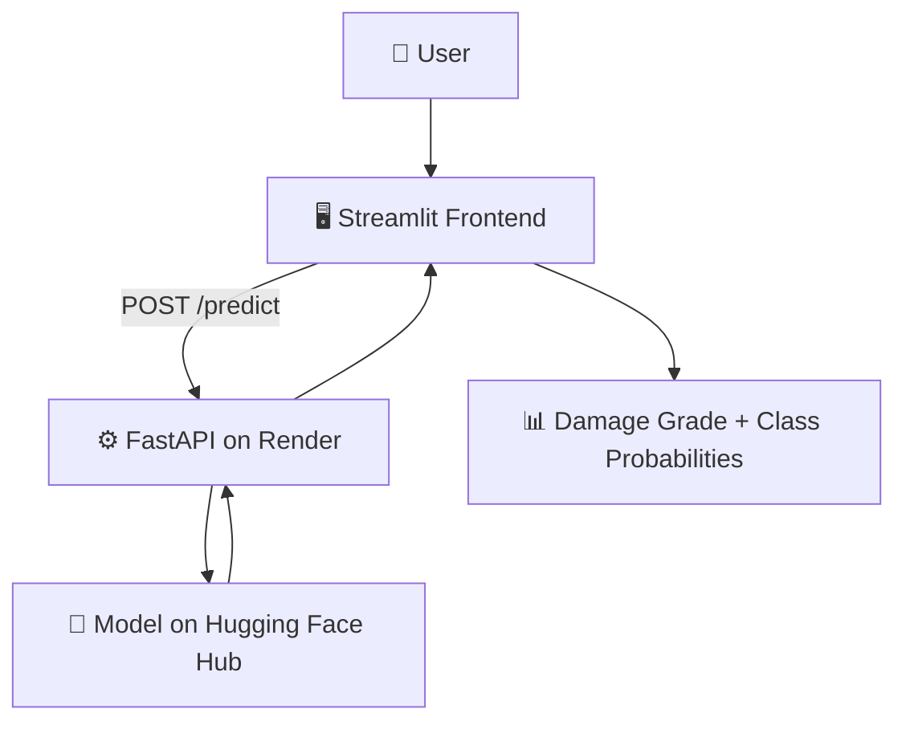

<div align="center">

# 🏚️ Earthquake Damage Prediction

**An end-to-end machine learning application that predicts building damage severity after an earthquake.**

[](https://www.python.org/)
[](https://fastapi.tiangolo.com/)
[](https://streamlit.io/)
[](https://scikit-learn.org/)
[](#-license)

[**🚀 Live Demo**](https://earthquake-damage-predictor.streamlit.app/) • [**📘 API Docs**](https://earthquake-damage-api.onrender.com/docs) • [**💻 Source**](https://github.com/codelikepreety/earthquake-damage-prediction)

</div>

<br>

<div align="center">
  
  <p><em>📸 Replace with a full-page screenshot of the Streamlit app's input form (see "Adding Screenshots" below)</em></p>
</div>

---

## ✨ Overview

This project predicts a building's **earthquake damage grade** from its structural and location-based features. It isn't just a notebook experiment — it follows the full path a real ML product takes:

```
Building Features → Preprocessing → Random Forest Model → FastAPI → Streamlit → Damage Grade + Probabilities
```

| Grade | Meaning |
|:---:|---|
| 🟢 **1** | Low damage |
| 🟡 **2** | Medium damage |
| 🔴 **3** | Almost complete destruction |

<br>

<table align="center">
<tr>
<td align="center" width="50%">
<br>
<em>📸 Input form — building & structural features</em>
</td>
<td align="center" width="50%">
<br>
<em>📸 Prediction result — damage grade & probabilities</em>
</td>
</tr>
</table>

---

## 🔌 How It Works



1. **User Input** — The Streamlit interface collects building and structural characteristics.
2. **API Request** — The frontend sends the feature values to the FastAPI `/predict` endpoint.
3. **Model Inference** — FastAPI loads the privately hosted model from Hugging Face Hub and runs the prediction.
4. **Result** — The API returns the predicted damage grade and class probabilities, rendered instantly by Streamlit.

---

## 🧠 The Model

A **Random Forest Classifier** was selected after comparing several configurations, then tuned specifically for deployment — trading a little raw capacity for a much smaller, faster-loading model.

```
Random Forest
├── n_estimators     = 20
├── max_features     = sqrt
├── min_samples_leaf = 2
├── random_state     = 42
└── n_jobs           = -1
```

<div align="center">

| Metric | Score |
|---|:---:|
| **Test Accuracy** | ~71.72% |
| **Macro F1** | ~0.648 |
| **Serialized Model Size** | ~72 MB |

</div>

---

## 🛠️ Tech Stack

<div align="center">

| Layer | Tools |
|---|---|
| 🤖 **Machine Learning** | Python · Pandas · NumPy · Scikit-learn · Joblib |
| ⚙️ **Backend** | FastAPI · Uvicorn · Pydantic |
| 🎨 **Frontend** | Streamlit · Requests |
| ☁️ **Deployment** | Render · Hugging Face Hub · Streamlit Community Cloud |
| 🧰 **Development** | Jupyter Notebook · VS Code · Git · GitHub |

</div>

---

## 📊 Dataset

Built on the **[Richter's Predictor: Modeling Earthquake Damage](https://www.drivendata.org/competitions/57/nepal-earthquake/)** dataset from DrivenData — building survey records collected in Nepal after the 2015 Gorkha earthquake.

> ⚠️ The raw dataset and trained model are intentionally excluded from the public repository (see [Security](#-security--deployment-notes) below).

---

## 📁 Project Structure

```
earthquake-damage-prediction/
│
├── api/
│   └── main.py                    # FastAPI inference service
│
├── data/
│   └── raw/                       # Local dataset (gitignored)
│
├── models/                        # Local model (gitignored)
│
├── notebooks/                     # EDA & model development
│
├── app.py                         # Streamlit application
├── requirements-api.txt
├── requirements-streamlit.txt
└── README.md
```

---

## 🔐 Security & Deployment Notes

- 🔒 `.env` is git-ignored
- 🔒 Raw CSV dataset files are git-ignored
- 🔒 The trained `.pkl` model is git-ignored
- 🤗 The model is hosted **privately** on Hugging Face Hub
- 🔑 FastAPI retrieves the model securely via an environment variable

This keeps the public repository focused on source code, notebooks, and architecture — not sensitive or oversized assets.

---

## 🎯 Key Takeaways

- Building a full ML classification pipeline, end to end
- Handling categorical and numerical features together
- Evaluating an imbalanced multi-class problem
- Optimizing a model for real-world deployment constraints
- Serving predictions through a REST API
- Connecting a frontend to a live ML backend
- Hosting a trained model separately from application code
- Shipping — not just training — an ML application

---

## 🚀 Try It Yourself

```bash
# Clone the repo
git clone https://github.com/codelikepreety/earthquake-damage-prediction.git
cd earthquake-damage-prediction

# Run the Streamlit app locally
pip install -r requirements-streamlit.txt
streamlit run app.py
```

Or just use the hosted version — no setup required:

<div align="center">

### 🔗 [earthquake-damage-predictor.streamlit.app](https://earthquake-damage-predictor.streamlit.app/)

</div>

---

## 👤 Author

**Anima Mishra**
🔗 [GitHub](https://github.com/codelikepreety)

---

<div align="center">
<sub>© 2026 Anima — All Rights Reserved.</sub>
<sub>Built with 🧠 and a lot of curiosity about what makes a building fall down.</sub>
</div>